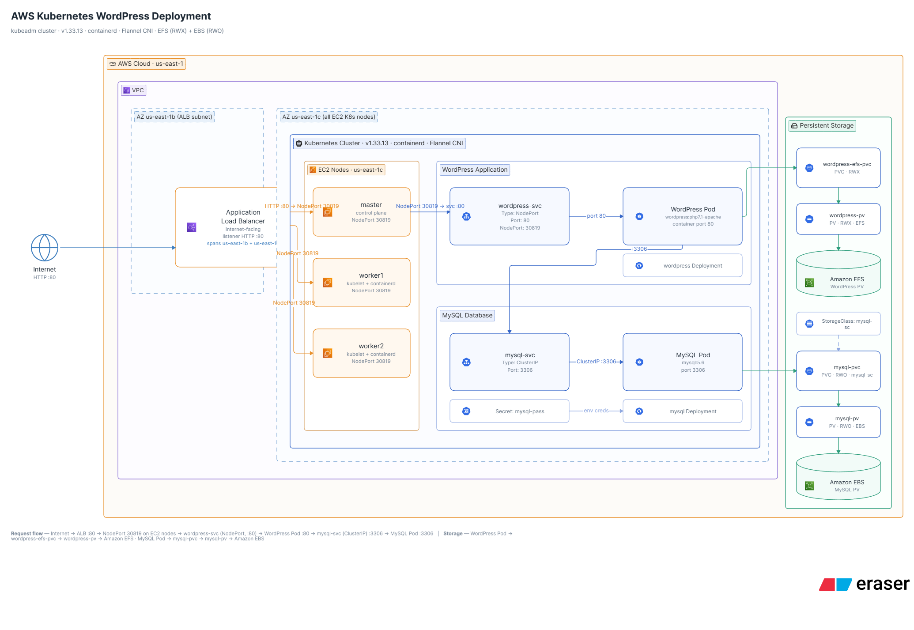

# WordPress on Kubernetes with AWS

A simple WordPress deployment running on a Kubernetes cluster hosted on AWS EC2.

The project uses Kubernetes for application management and AWS storage services for persistent data.

## Architecture



## Technologies

- AWS EC2
- Kubernetes v1.33.13
- kubeadm
- containerd
- Flannel CNI
- WordPress
- MySQL
- AWS EFS
- AWS EBS
- Kubernetes Persistent Volumes
- Kubernetes Persistent Volume Claims
- Kubernetes Services
- Kubernetes Secrets

## Project Structure

```text
.
├── architecture
│   └── architecture.png
└── kubernetes
    ├── mysql
    │   ├── mysql-app.yaml
    │   ├── mysql-pvc.yaml
    │   ├── mysql-sc.yaml
    │   ├── mysql-svc.yaml
    │   └── mysqlsecret.yaml
    └── wordpress
        ├── wordpress-app.yaml
        ├── wordpress-pv.yaml
        ├── wordpress-pvc.yaml
        ├── wordpress-sc.yaml
        └── wordpress-svc.yaml
Components
Kubernetes Cluster

The cluster consists of:

1 Control Plane node
2 Worker nodes
containerd as the container runtime
Flannel as the CNI
WordPress

WordPress runs as a Kubernetes Deployment and is exposed using a LoadBalancer Service.

The WordPress files are stored on an AWS EFS volume through Kubernetes PV/PVC.

MySQL

MySQL runs as a Kubernetes Deployment and is exposed internally using a ClusterIP Service.

MySQL data is stored on AWS EBS through Kubernetes PV/PVC.

The database password is provided using a Kubernetes Secret.

Storage

The project uses two AWS storage services:

Amazon EFS → WordPress persistent files
Amazon EBS → MySQL persistent data
Traffic Flow
Internet
   |
AWS Load Balancer
   |
NodePort :30819
   |
WordPress Service :80
   |
WordPress Pod :80
   |
MySQL Service :3306
   |
MySQL Pod :3306
Deployment

Apply the MySQL resources:

kubectl apply -f kubernetes/mysql/

Apply the WordPress resources:

kubectl apply -f kubernetes/wordpress/

Check the resources:

kubectl get pods
kubectl get svc
kubectl get pv
kubectl get pvc
Notes

This project was created as a hands-on Kubernetes and AWS practice project, focusing on:

Kubernetes Deployments
Services
NodePort / LoadBalancer
Persistent Volumes
Persistent Volume Claims
StorageClasses
Kubernetes Secrets
AWS EFS
AWS EBS
Kubernetes networking
